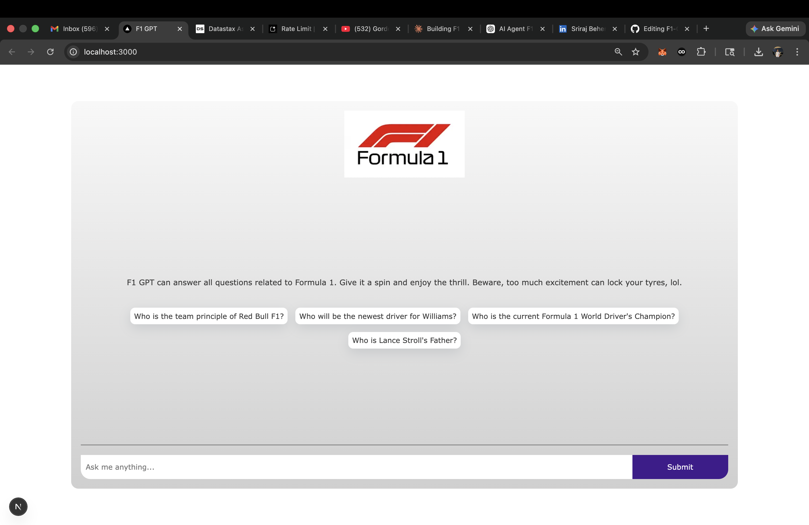
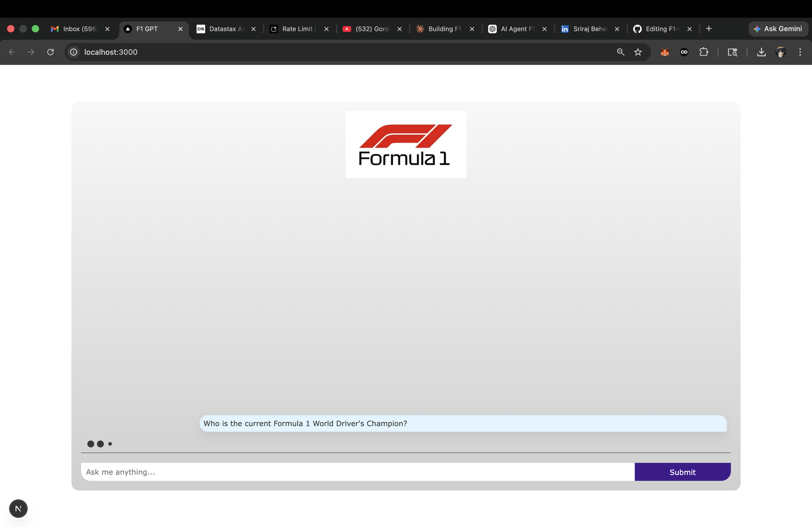
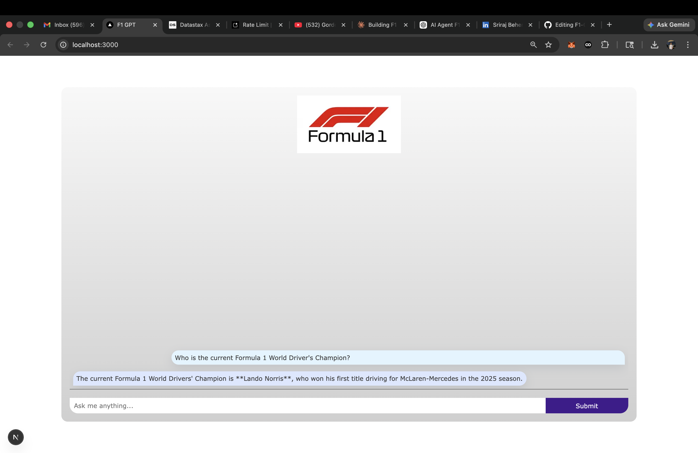
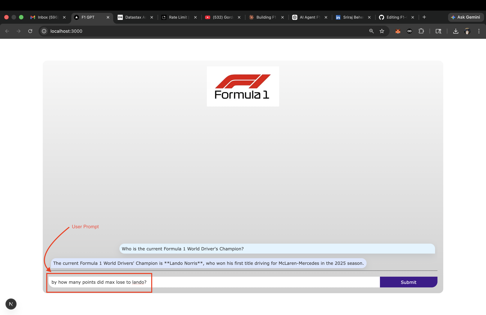
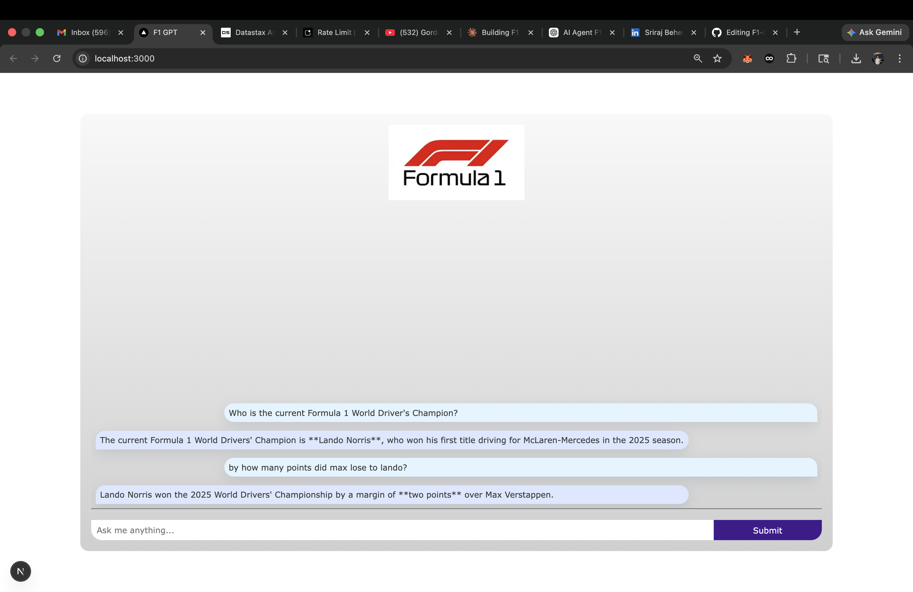

# 🏎️ F1 GPT

An AI-powered Formula 1 assistant that answers anything about F1 — including events **beyond the model's knowledge cutoff** — using Retrieval-Augmented Generation (RAG), Google Gemini embeddings, and a DataStax vector database.

> Built as a hands-on project to deeply understand LLMs, RAG pipelines, vector embeddings, and how to ground generative AI in real, up-to-date knowledge.

---

## 🚀 Demo

> Ask anything: driver standings, race results, team histories, regulation changes, and more.







---

## 🧠 How It Works

### The Core Problem

`gemini-3.1-flash-lite` has a **knowledge cutoff of January 2025**. That means it cannot answer questions about the 2025 season, recent race results, driver transfers (like Hamilton to Ferrari), or any F1 news after that date.

**RAG solves this.** Instead of retraining the model, we retrieve the most relevant, up-to-date context from our own vector database and inject it into the prompt — giving the LLM fresh knowledge on demand.

### Architecture

```
User Query
    │
    ▼
Gemini Embedding Model (gemini-embedding-001)
    │  Converts user query → 768-dimensional vector
    ▼
DataStax Vector DB (AstraDB)
    │  Finds top-10 most semantically similar chunks via dot-product similarity
    ▼
Context Injection
    │  Retrieved chunks + user query → structured system prompt
    ▼
Gemini LLM (gemini-3.1-flash-lite-preview)
    │  Generates grounded, markdown-formatted response
    ▼
Streamed Response → UI (Next.js + AI SDK)
```

### Data Pipeline (`loadDB.ts`)

Before the app can answer current questions, we seed the vector database:

```
F1 URLs (Wikipedia, Sky Sports, etc.)
    │
    ▼
Puppeteer Scraper  →  Raw page text
    │
    ▼
RecursiveCharacterTextSplitter
    │  chunkSize: 512, chunkOverlap: 100
    ▼
Gemini Embedding Model  →  768-dim vector per chunk
    │
    ▼
DataStax AstraDB  →  { $vector, text } stored per chunk
```

---

## 🔍 Key Technical Decisions (and Why They Matter)

### 1. Chunk Size: 512 tokens with 100-token overlap

This is one of the most underrated variables in RAG. Too large → noisy, irrelevant context bleeds into the LLM. Too small → you lose the semantic meaning of a passage. The overlap ensures that context spanning a chunk boundary isn't lost.

### 2. Dot Product Similarity (not Cosine)

The vector collection uses `dot_product` as its similarity metric. Since Gemini embeddings are normalized, dot product and cosine similarity are mathematically equivalent — but dot product is computationally faster in AstraDB, making retrieval snappier.

### 3. `outputDimensionality: 768`

The Gemini embedding model supports variable output dimensions. We cap at 768 to balance retrieval quality with storage efficiency. Higher dimensions don't always mean better retrieval — they increase storage and latency without proportional gains for this use case.

### 4. Streaming Responses

Using the `streamText` API from the Vercel AI SDK, responses stream token-by-token to the UI. This dramatically improves perceived performance — users see content immediately rather than waiting for the full response.

### 5. Retrieval ≠ Answer Quality (automatically)

Retrieving the top-10 most similar vectors doesn't guarantee they are all relevant to the user's question. The system prompt explicitly tells the LLM to rely on its own knowledge if the context doesn't contain the information — preventing hallucinated citations while still leveraging the model's base knowledge.

---

## 🛠️ Tech Stack

| Layer          | Technology                                              |
| -------------- | ------------------------------------------------------- |
| Framework      | Next.js 16 (App Router)                                 |
| LLM            | Google Gemini (`gemini-3.1-flash-lite-preview`)         |
| Embeddings     | Google Gemini (`gemini-embedding-001`)                  |
| Vector DB      | DataStax AstraDB                                        |
| AI SDK         | Vercel AI SDK (`ai`, `@ai-sdk/google`, `@ai-sdk/react`) |
| Scraping       | Puppeteer via LangChain (`PuppeteerWebBaseLoader`)      |
| Text Splitting | LangChain (`RecursiveCharacterTextSplitter`)            |
| Styling        | Tailwind CSS v4                                         |

---

## ⚙️ Getting Started

### Prerequisites

- Node.js 18+
- A [Google AI Studio](https://aistudio.google.com/) account (for Gemini API key)
- A [DataStax AstraDB](https://astra.datastax.com/) account (free tier works)

### 1. Clone the Repository

```bash
git clone https://github.com/your-username/f1-gpt.git
cd f1-gpt
```

### 2. Install Dependencies

```bash
npm install
```

### 3. Configure Environment Variables

Create a `.env.local` file in the root:

```env
GEMINI_API_KEY=your_gemini_api_key_here
ASTRA_DB_API_ENDPOINT=your_astradb_endpoint_here
ASTRA_DB_APPLICATION_TOKEN=AstraCS:your_token_here
ASTRA_DB_NAMESPACE=default_keyspace
ASTRA_DB_COLLECTION=f1_vectors
```

### 4. Seed the Vector Database

This step scrapes F1 data, generates embeddings, and stores them in AstraDB. **Run this once** before starting the app.

```bash
npm run seed
```

> ⚠️ The seeding script uses Puppeteer for scraping and calls the Gemini Embeddings API for each chunk. It includes a 1-second delay between API calls to avoid rate limiting. Expect it to take several minutes.

### 5. Start the Development Server

```bash
npm run dev
```

Open [http://localhost:3000](http://localhost:3000) in your browser.

---

## 🌐 Data Sources

The following URLs are scraped and embedded during the seeding phase:

| Source                                 | Content                          |
| -------------------------------------- | -------------------------------- |
| Wikipedia — Formula One                | General F1 history, rules, teams |
| Wikipedia — 2025 F1 World Championship | 2025 season data (post-cutoff)   |
| Wikipedia — 2026 F1 World Championship | Upcoming season info             |
| Sky Sports — Hamilton to Ferrari       | Transfer news (post-cutoff)      |
| Wikipedia — Female F1 Drivers          | Historical list                  |

To add more sources, simply append URLs to the `f1Data` array in `scripts/loadDB.ts` and re-run `npm run seed`.

---

## 🔧 Extending the Project

### Add New Data Sources

```typescript
// scripts/loadDB.ts
const f1Data = [
  // existing URLs...
  "https://www.formula1.com/en/results/2025", // Add any URL here
];
```

### Adjust Retrieval Count

In `app/api/chat/route.ts`, change `limit: 10` to retrieve more or fewer context chunks:

```typescript
const cursor = collection.find(null, {
  sort: { $vector: embedding.embeddings[0].values },
  limit: 10, // Increase for more context, decrease for faster/cheaper responses
});
```

### Tune Chunk Size

In `scripts/loadDB.ts`:

```typescript
const splitter = new RecursiveCharacterTextSplitter({
  chunkSize: 512, // Try 256–1024 depending on your content density
  chunkOverlap: 100, // Keep ~15-20% of chunkSize
});
```

---

## 💡 What I Learned Building This

- **RAG is a retrieval problem first, a generation problem second.** The LLM is only as good as what you feed it. Invest in your chunking and embedding strategy before tweaking the LLM.
- **Vector similarity finds mathematically close vectors — not always semantically relevant ones.** The system prompt needs to guide the LLM on how to handle retrieved context that doesn't perfectly match the question.
- **Streaming UX matters more than you think.** A 3-second wait feels fine when tokens are streaming; the same 3 seconds feels broken if the UI just hangs.
- **Chunk overlap is not optional.** Without it, facts that span a chunk boundary simply vanish from your retrieval results.
